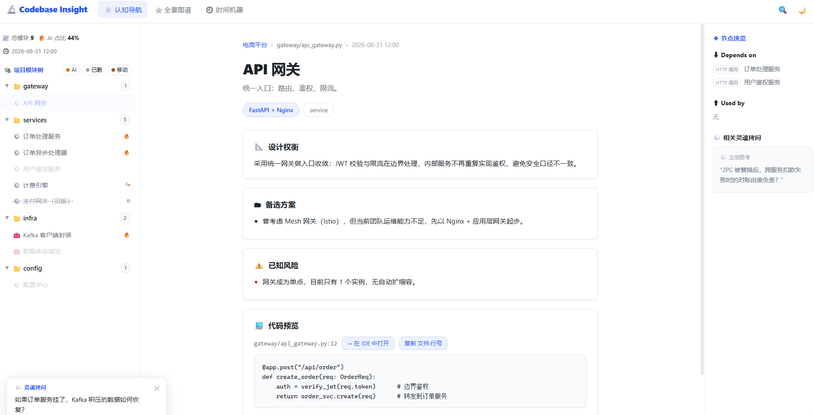
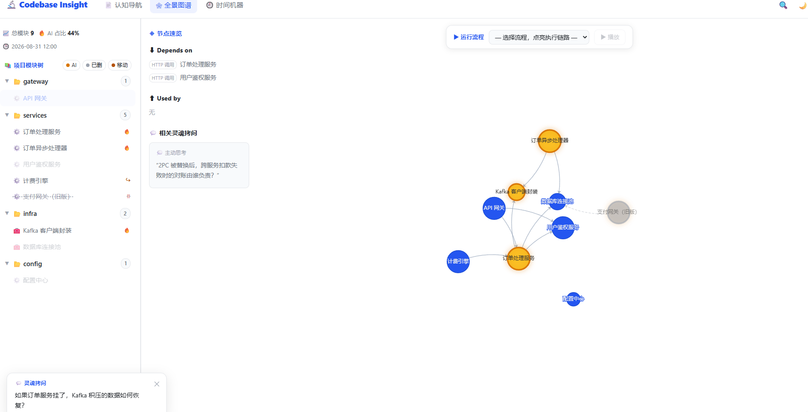

# Codebase Insight Visualizer

> **See the macro structure (map), touch the micro details (jump), trace decisions (story), control increments (cache).**

Turn "dead code" into "living knowledge": scan a real codebase, extract a deterministic fact base
(dependency graph), let the AI add only semantic sticky notes (design trade-offs / alternatives /
known risks / runtime flows), and deliver an **offline, single-file, three-column document-style
interactive HTML** — gold nodes = AI-generated code, gray dashed = deleted historical archive,
every claim navigates to its real source coordinates in your IDE.

> 简体中文版见 [README.md](./README.md)

## 预览（真实产物截图）

| 认知导航（三栏文档式） | 全景图谱（流程高亮） |
|---|---|
|  |  |

- **认知导航**：左侧模块树（🔥=AI 生成 / 🗑=已删除存档 / ↪=移动）、中间节点详情（设计权衡 / 备选方案 / 已知风险 / 代码预览 / 符号索引）、右侧 Depends on / Used by 速览。
- **全景图谱**：ECharts 力导向图，金色=AI 生成、灰色=已删除（虚线边）；「▶ 运行流程」选择后链路节点按执行顺序点亮，其余淡化。

## Core philosophy

```
Scripts give facts, AI gives judgment — a wrong map is the script's fault (fixable),
a wrong sticky note is AI hallucination (discardable). Never contaminate each other.
```

- **Fact base (`scanner.py`)** — file hashes, symbols, import edges: all deterministically
  extracted; the AI has no write access.
- **Semantic enrichment (`instructions.md`)** — AI fills only
  `design_reason / alternatives / known_risks / flows / soul_questions`.
- **Whitelist stitching (`manifest_builder.py`)** — out-of-scope fields, invented nodes, and
  unbaked edges are silently dropped and reported.
- **Delivery contract** — validate then atomically deliver; **any failure preserves the previous
  artifact** (pattern borrowed from archify).

## Quick start (end-to-end)

```bash
# 1. Scan the fact base (incremental cache: second run only processes changes)
python scripts/scanner.py --project <your-project-path> --config config.yaml

# 2. (optional) AI semantic enrichment: feed fact_graph.json to an LLM;
#    follow instructions.md to produce the AI JSON (privacy_mode: strict
#    sends only signatures + comments, never function bodies)

# 3. Stitch & validate
python scripts/manifest_builder.py \
    --fact-graph <fact_graph.json> --ai-output <ai_output.json> \
    --out <final_manifest.json> [--old-manifest <previous version>]

# 4. Build the deliverable dashboard (offline single file)
python scripts/build.py --manifest <final_manifest.json> \
    --out dashboard.html [--echarts echarts.min.js]   # --echarts inlines for intranet
```

**Self-hosting example** (scan this project's `scripts/`):

```bash
python scripts/scanner.py --project scripts
python scripts/build.py --manifest .../final_manifest.json --out demo/dashboard_real.html
```

## Data contract (`schemas/final_manifest.schema.json`)

- `schema_version: 1` + `manifest_type: "codebase-insight"` (locked by `const`)
- `repository {url, revision(40-hex), root}` — repository evidence binding;
  non-git projects use all zeros by convention
- `nodes[]`: `id/name/type/file_path/start_line/hash/symbols` are **facts**
  (`symbols` is `[{name, line}]`, 1-based, deterministic);
  `design_reason/alternatives/known_risks/code_snippet/story` are semantics
- `status`: `active | deleted | moved` (deleted nodes are kept as historical archive,
  rendered as gray dashed)
- `edges[]`: `factual: true` = scanner facts; `factual: false` = semantic edges limited to
  `动态调用 | 消息 | 接口实现 | 配置引用` with both endpoints already existing
- `flows[]`: runtime-flow narratives; adjacent steps must be backed by a factual edge or
  declare a `gap_hint` explicitly
- `soul_questions[]`: derived from real risks, 2–5 items

## Repository layout

```
codebase-insight-visualizer/
├── instructions.md            # AI semantic-layer system prompt (iron rules + whitelist + failure protocol)
├── config.yaml                # user config (ignore rules / cache / privacy mode / IDE protocol)
├── manifest.json              # Skill assembly metadata
├── schemas/
│   └── final_manifest.schema.json
├── scripts/
│   ├── scanner.py             # CLI: scan / ignore / edge resolution / cache IO / git evidence
│   ├── fingerprint.py         # SHA-256 + symbol-skeleton fingerprint + containment
│   ├── lifecycle.py           # delta comparator (five states) + snapshot rotation (keep 30)
│   ├── manifest_builder.py    # whitelist / coordinate validation / incremental merge /
│   │                          #   triple-rule AI judgement / atomic delivery
│   ├── build.py               # manifest injection + ECharts inlining + atomic export
│   └── plugins/               # python/js/go/java regex plugins (unknown languages degrade
│                              #   to file-level nodes)
├── demo/
│   ├── dashboard_proto.html   # template (docsify-style three columns + legend filter + flow highlight)
│   └── dashboard_real.html    # end-to-end artifact (real manifest injected)
└── tests/                     # 26 unittest cases (zero dependencies)
```

## Tests

```bash
cd codebase-insight-visualizer
python -m unittest discover -s tests -p "test_*.py"
```

Coverage: plugin extraction (relative imports / `as` aliases / line numbers), schema contract,
lifecycle five states + snapshot rotation, scanner end-to-end (delete/move/add/modify +
root-artifact self-exclusion), stitching layer (invented node / unbaked edge filtering,
degraded mode, incremental retention, triple-rule judgement, delivery preservation),
build injection / inlining / preservation.

## Honest limitations

- Regex plugins may mis/under-detect dynamic imports or quoted imports; unknown languages
  become file-level nodes (no edges)
- `is_ai_generated` triple-rule judgement (git status + time window + user confirmation)
  has an inherent uncertainty band; the UI shows the evidence and allows manual correction
- Symbol-level line numbers are now included; class/function granularity only, not expression-level
- Time machine data layer is ready (30 snapshot rotation); the diff view is fully wired
- `build.py --echarts` requires a local `echarts.min.js` (e.g. `npm i echarts` or vendor download)

## Roadmap

1. ✅ Symbol-level line numbers (list + IDE jump per symbol)
2. ✅ Time machine UI (snapshot list + diff view: green added / red removed / yellow moved)
3. ⬜ tree-sitter optional enhancement (auto-detect and replace regex plugins when available)
4. ⬜ `validator.py` golden test sets (small Django / Go microservice / mixed project)
